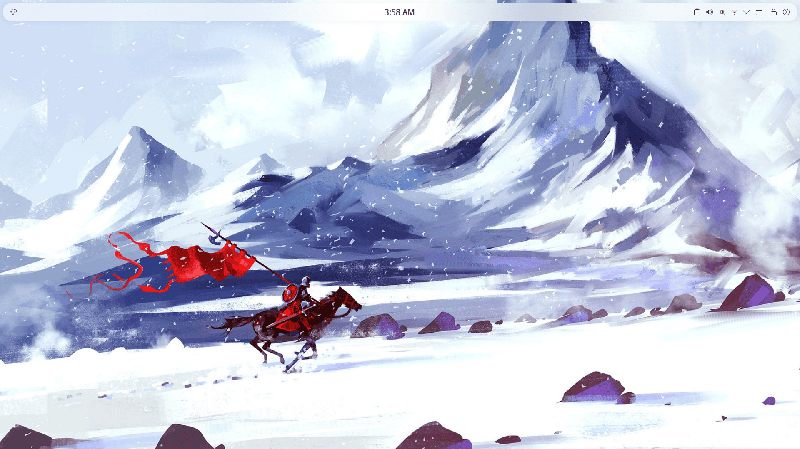
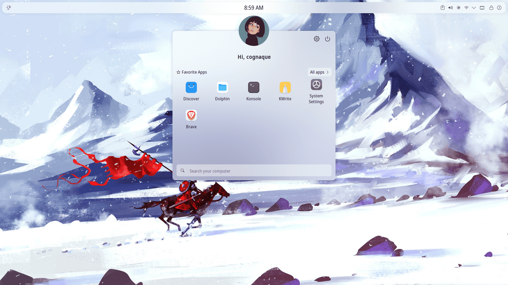
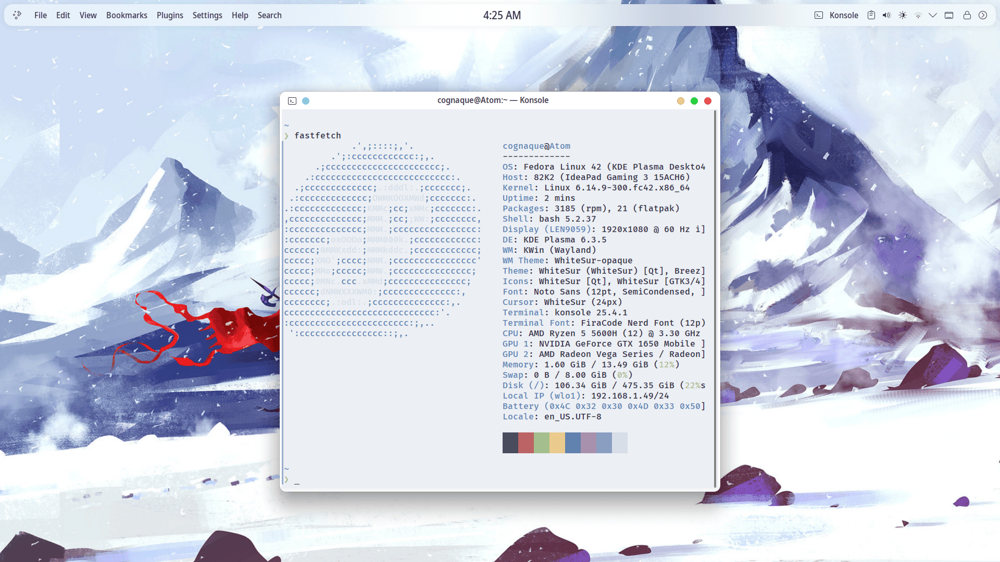
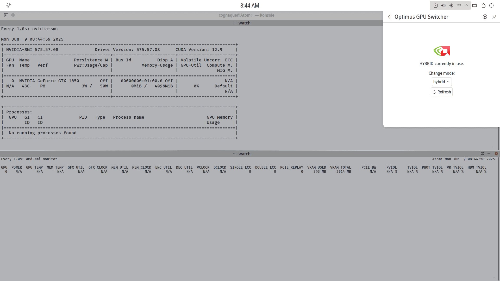
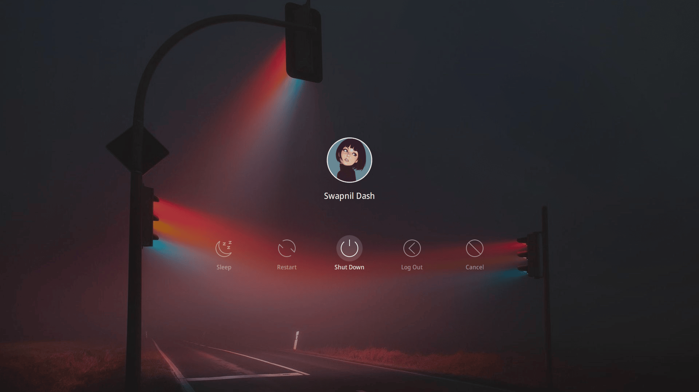

# Table Of Content

- [[#Setup 42 Fedora KDE Plasma|Setup 42 Fedora KDE Plasma]]
- [[#Getting Started|Getting Started]]
	- [[#Getting Started#Download & Verification|Download & Verification]]
	- [[#Getting Started#Creating Bootable Media|Creating Bootable Media]]
- [[#Post-Install Setup|Post-Install Setup]]
	- [[#Post-Install Setup#Firmware Updates|Firmware Updates]]
	- [[#Post-Install Setup#Network Configuration|Network Configuration]]
	- [[#Post-Install Setup#DNF Package Manager Tweaks|DNF Package Manager Tweaks]]
	- [[#Post-Install Setup#Initial System Setup|Initial System Setup]]
	- [[#Post-Install Setup#Adding Repositories|Adding Repositories]]
- [[#Graphics & Hardware|Graphics & Hardware]]
	- [[#Graphics & Hardware#Kernel & Build Tools|Kernel & Build Tools]]
	- [[#Graphics & Hardware#AMD Graphics Setup|AMD Graphics Setup]]
	- [[#Graphics & Hardware#NVIDIA Graphics Setup|NVIDIA Graphics Setup]]
		- [[#NVIDIA Graphics Setup#Option 1: RPM Fusion (Recommended for most users)|Option 1: RPM Fusion (Recommended for most users)]]
		- [[#NVIDIA Graphics Setup#Option 2: Official NVIDIA Repository|Option 2: Official NVIDIA Repository]]
	- [[#Graphics & Hardware#User Permissions|User Permissions]]
	- [[#Graphics & Hardware#Hybrid Graphics & PRIME|Hybrid Graphics & PRIME]]
	- [[#Graphics & Hardware#GPU Application Offload|GPU Application Offload]]
- [[#Customization & Extras|Customization & Extras]]
	- [[#Customization & Extras#KDE Customization|KDE Customization]]
	- [[#Customization & Extras#System Utilities & CPU Control|System Utilities & CPU Control]]
	- [[#Customization & Extras#Multimedia & System Settings|Multimedia & System Settings]]
	- [[#Customization & Extras#Plymouth Boot Splash|Plymouth Boot Splash]]
	- [[#Customization & Extras#Disabling Unwanted Services|Disabling Unwanted Services]]
			- [[#Option 2: Official NVIDIA Repository#==Some additional articles that you may also find useful==|Some additional articles that you may also find useful]]
- [[#Final Thoughts|Final Thoughts]]

##  Setup 42 Fedora KDE Plasma

This guide is mainly written for Linux newcomers, but if you're already experienced with Linux distros, feel free to skim through and pick what you need. I've tried to make this as comprehensive as possible while keeping things beginner-friendly.

 
## Getting Started

### Download & Verification

First things first - let's get Fedora 42 KDE downloaded safely:

**Download Options:**
- Direct download: [Official Fedora KDE Site](https://fedoraproject.org/kde/)
- Torrent (usually faster): [Fedora Torrent Site](https://torrent.fedoraproject.org/)

**Verification (Don't skip this!):**
Look, I know verification seems tedious, but trust me - one corrupted download and you'll be scratching your head for hours wondering why things aren't working right.

![[KDE6.png]]

1. Download the checksum file the same folder as your ISO

2. Import Fedora's GPG key:
   ```bash
   curl -O https://fedoraproject.org/fedora.gpg
   ```
   (You can verify key details [here](https://fedoraproject.org/security))

3. Verify the checksum file:
   ```bash
   gpgv --keyring ./fedora.gpg Fedora-KDE-42-1.1-x86_64-CHECKSUM
   ```

4. Check if your ISO matches:
   ```bash
   sha256sum --ignore-missing -c Fedora-KDE-42-1.1-x86_64-CHECKSUM
   ```

If everything checks out as "OK" or "valid", you're good to go!

### Creating Bootable Media

Grab a USB drive with at least 4GB space and use the [official Fedora Media Writer](https://flathub.org/apps/org.fedoraproject.MediaWriter). It's reliable and handles everything automatically.

---

## Post-Install Setup

### Firmware Updates

> **⚠️ Important Note**
> 
> If your laptop can update firmware without needing Windows, definitely look into this. It's one of those small things that makes your life easier down the road.

**Before updating to new firmware**, check the discussion forums or blogs related to your specific laptop model.  
If other users report that the **firmware update works without issues**, it’s generally safe to proceed.  
**BIOS updates are especially critical**, so exercise extra caution.  
**Make sure to research thoroughly online before installing any firmware updates.**

```
sudo dnf install fwupd
sudo fwupdmgr refresh
fwupdmgr get-devices
fwupdmgr get-updates
sudo fwupdmgr update
```

**Be careful with that last command!** Use the other commands first to see what's available, cross-check with your vendor's official site, and check forums for any reported issues.

### Network Configuration

I set up a static IP for my laptop on my home router using its MAC address. Fedora randomizes MAC addresses by default (good for privacy), but I needed consistency since my Nextcloud server only accepts connections from specific IPs.

Here's how to use your real MAC address:

1. Click on your WiFi network, then **Configure**
2. Go to **Wi-Fi** tab, find **Restrict to device** section
3. Click the dropdown - you'll see your system's hardware MAC address
4. Copy that MAC address
5. Paste it in the **Cloned MAC Address** field
6. Hit **Apply** and reconnect to WiFi

**Custom DNS Setup:**
While you're there, might as well set up custom DNS:

1. Go to **IPv4** and **IPv6** tabs
2. Under **Method**, choose **Only addresses**
3. In the DNS servers section, add your preferred DNS

I use Google's DNS, but test a few options (Google, Cloudflare, your ISP) and see which works best for your location:

```
Google DNS:
8.8.8.8, 8.8.4.4 (IPv4)
2001:4860:4860::8888, 2001:4860:4860::8844 (IPv6)

Cloudflare DNS:
1.1.1.1, 1.0.0.1 (IPv4)
2606:4700:4700::1111, 2606:4700:4700::1001 (IPv6)
```

### DNF Package Manager Tweaks

Let's speed up package downloads:

```bash
sudo nano /etc/dnf/dnf.conf
```

Add these lines under `[main]`:

```
max_parallel_downloads=10
fastestmirror=1
```

Press **Ctrl + X**, then **Y**, then **Enter** to save.

### Initial System Setup

If you didn't set a hostname during installation, do it now:

```bash
sudo hostnamectl set-hostname <your-hostname>
```

**First System Update:**
For your very first update, I actually recommend using the Discover software center. Yeah, it's slower, but it's more stable and handles any hiccups better than the command line for that crucial first update.

You can always use the faster command later:
```bash
sudo dnf upgrade
```

> **Note:** Don't enable third-party repositories yet - wait until after your first update and reboot.

### Adding Repositories

After your first update and reboot, let's add the good stuff:

**Enable Third-Party Repos via GUI:**
Open **Discover Software Center → Settings** and check:
- RPM Fusion for Fedora 42 - NonFree - NVIDIA Driver
- NonFree - Steam

**Command Line Method:**
```bash
sudo dnf config-manager setopt fedora-cisco-openh264.enabled=1

sudo dnf install https://mirrors.rpmfusion.org/free/fedora/rpmfusion-free-release-$(rpm -E %fedora).noarch.rpm \
https://mirrors.rpmfusion.org/nonfree/fedora/rpmfusion-nonfree-release-$(rpm -E %fedora).noarch.rpm

sudo dnf install rpmfusion-*-appstream-data

flatpak remote-add --if-not-exists flathub https://dl.flathub.org/repo/flathub.flatpakrepo
```

> **Caution:** If you're having graphics driver issues with RPM Fusion, stick to Fedora's repositories for now. You can add Flatpak support separately.

---

## Graphics & Hardware

### Kernel & Build Tools

Install the essentials for building drivers and modules:

```bash
sudo dnf install kernel-headers kernel-devel-matched
sudo dnf install kernel-headers kernel-devel tar bzip2 make automake gcc gcc-c++ pciutils elfutils-libelf-devel libglvnd-opengl libglvnd-glx libglvnd-devel acpid pkgconfig dkms
```

### AMD Graphics Setup

Good news for AMD users - the open-source drivers are excellent and included by default!

**Install hardware acceleration:**
```bash
sudo dnf install mesa-va-drivers mesa-vdpau-drivers libva-utils vdpauinfo
```

**Verify everything's working:**
```bash
vainfo
vdpauinfo
```

**AMD GPU monitoring (like nvidia-smi for AMD):**
```bash
sudo dnf install amdsmi
```

**For full hardware video decoding**, swap to the "freeworld" versions from RPM Fusion:

```bash
sudo dnf swap mesa-va-drivers mesa-va-drivers-freeworld 
sudo dnf swap mesa-vdpau-drivers mesa-vdpau-drivers-freeworld
```

These freeworld packages unlock additional codecs and acceleration features that are crucial for AMD hardware.

**Important:** Don't mix standard and freeworld versions - it'll cause conflicts during updates. If you're having issues with AMD graphics, stick with the standard Fedora repository versions.

Check [RPM Fusion's documentation](https://rpmfusion.org/Howto) for more details.

**Reboot after installing AMD drivers.**

### NVIDIA Graphics Setup

NVIDIA is trickier. You have two main options:

#### Option 1: RPM Fusion (Recommended for most users)

> **⚠️ Pro Tip:** Don't just blindly upgrade drivers. Check versions first - only install if it's actually newer than what you have.

```bash
sudo dnf install akmod-nvidia
```

**Don't reboot yet!** Wait for the drivers to compile:

```bash
modinfo -F version nvidia
```

If you don't see a version number, wait up to 5 minutes and try again. Only reboot once you see the NVIDIA driver version.

#### Option 2: Official NVIDIA Repository

If RPM Fusion drivers give you trouble, try the official repo. As of writing, there's no Fedora 42 repo yet, but Fedora 41's works fine:

```bash
wget https://developer.download.nvidia.com/compute/cuda/repos/fedora41/x86_64/cuda-fedora41.repo
sudo dnf config-manager --add-repo ./cuda-fedora41.repo
sudo dnf install kmod-nvidia-latest-dkms nvidia-driver nvidia-driver-cuda nvidia-driver-libs nvidia-driver-cuda-libs nvidia-settings --allowerasing
```

Same deal - verify the driver loaded before rebooting:
```bash
modinfo -F version nvidia
```

**After reboot, install hardware acceleration:**
```bash
sudo dnf install nvidia-vaapi-driver libva-utils vdpauinfo xorg-x11-nvidia
```

### User Permissions

Add yourself to the right groups for GPU access:

```bash
sudo usermod -aG render,video $USER
```

Log out and back in (or reboot) for this to take effect.

### Hybrid Graphics & PRIME

Got a laptop with both integrated and discrete graphics? Let's set that up properly.

**BIOS Settings:**
- Disable Secure Boot
- Enable Switchable Graphics

**Check your setup:**
```bash
/sbin/lspci | grep -e VGA
/sbin/lspci | grep -e 3D
```

If your NVIDIA card shows up in the second command, you're in hybrid mode.

**Verify with:**
```bash
switcherooctl
```

You should see something like:
```
Device: 0
  Name:        AMD Cezanne [Radeon Vega Series]
  Default:     yes
  Environment: DRI_PRIME=pci-0000_05_00_0

Device: 1
  Name:        NVIDIA Corporation TU117M [GeForce GTX 1650]
  Default:     no
  Environment: __GLX_VENDOR_LIBRARY_NAME=nvidia __NV_PRIME_RENDER_OFFLOAD=1 __VK_LAYER_NV_optimus=NVIDIA_only
```

That `Default: no` confirms hybrid mode is working.

**Install [EnvyControl](https://github.com/bayasdev/envycontrol) for easy switching:**
```bash
sudo dnf copr enable sunwire/envycontrol
sudo dnf install python3-envycontrol
```

**KDE Widget:**

Add the "[Optimus GPU Switcher](https://github.com/enielrodriguez/optimus-gpu-switcher)" widget to your panel for easy GPU switching.

### GPU Application Offload

**Command line method (NVIDIA):**
```bash
env __GLX_VENDOR_LIBRARY_NAME=nvidia __NV_PRIME_RENDER_OFFLOAD=1 __VK_LAYER_NV_optimus=NVIDIA_only <your_application>

# Or the simpler way:
switcherooctl launch -g 1 <your_application>
```

**KDE GUI method:**
1. Find the app's `.desktop` file in `/usr/share/applications/` or `~/.local/share/applications/`
2. Right-click the application → Properties → Application tab
3. Advanced Options → Check "Run using dedicated graphics card"

This creates a local `.desktop` file in `~/local/share/applications/` that always runs the app on your discrete GPU.

---

## Customization & Extras

### KDE Customization

Time to make KDE look awesome! First, install build dependencies:

```bash
sudo dnf install git cmake extra-cmake-modules gcc-g++ \
kf6-kwindowsystem-devel plasma-workspace-devel libplasma-devel \
qt6-qtbase-private-devel qt6-qtbase-devel kwin-devel \
kf6-knotifications-devel kf6-kio-devel kf6-kcrash-devel \
kf6-ki18n-devel kf6-kguiaddons-devel libepoxy-devel \
kf6-kglobalaccel-devel kf6-kcmutils-devel kf6-kconfigwidgets-devel \
kf6-kdeclarative-devel kdecoration-devel wayland-devel \
libX11-devel libXext-devel qt6-qttools-devel qt6-qtsvg-devel
```

[**Better Blur Effect](https://github.com/taj-ny/kwin-effects-forceblur):**
```bash
git clone https://github.com/taj-ny/kwin-effects-forceblur.git
cd kwin-effects-forceblur
mkdir build && cd build
cmake ../ -DCMAKE_INSTALL_PREFIX=/usr
make -j
sudo make install
```

[**Kvantum Theme Engine](https://github.com/tsujan/Kvantum/releases):**

Method 1 (latest version):
```bash
# Download latest tar.xz from https://github.com/tsujan/Kvantum/releases
# Example for version 1.1.5:
tar -xf Kvantum-1.1.5.tar.xz
cd Kvantum-1.1.5
cd Kvantum
mkdir build
cd build
cmake ..
sudo make install
```

Method 2 (easier but older):
```
sudo dnf install kvantum
```

### System Utilities & CPU Control

**Auto CPU Frequency Management:**
```bash
git clone https://github.com/AdnanHodzic/auto-cpufreq.git
cd auto-cpufreq
sudo ./auto-cpufreq-installer
sudo auto-cpufreq --install
```

This tool dynamically manages your CPU frequency based on usage - great for laptop battery life! I’ve included a config file — tweak it however you like.

### Multimedia & System Settings

**KDE System Settings modules:**
```bash
sudo dnf install plymouth-kcm kcm_systemd flatpak-kcm sddm-kcm
sudo dnf install cronie cronie-anacron kcron 
```

**Multimedia codecs:**
```bash
sudo dnf group install multimedia
```

**Font rendering tip:** Go to System Settings → Appearance → Fonts, enable Sub-pixel rendering (RGB) and set Hinting to Medium (or adjust to your preference).

### Plymouth Boot Splash

**Speed up boot by disabling a slow service:**
```bash
sudo systemctl disable NetworkManager-wait-online.service
```

**Change boot splash theme:**
```bash
# List available themes
plymouth-set-default-theme --list

# Set your preferred theme
sudo plymouth-set-default-theme -R <theme-name>
sudo dracut -f
```

### Disabling Unwanted Services

Calender Notification and Discover autostart at boot and use additional RAM. To disable them:

1. Find the `.desktop` file in `/etc/xdg/autostart/` or `~/.config/autostart/`
2. Open it with a text editor
3. Add `Hidden=true` after the `[Desktop Entry]` line and comment out the lines related to autostart phase. 
4. Save the file

This prevents the application from autostarting without completely removing it.

---
##### ==Some additional articles that you may also find useful==
- [RAM Management](https://medium.com/@manorit2001/linux-less-ram-want-more-a-guide-to-increasing-your-ram-in-linux-5d5efee6ae2a)
- [Paul Sørensen's Blog](https://paulsorensen.io/fedora-kde-plasma-post-installation-guide/)
- [Arch Wiki](https://wiki.archlinux.org/title/Table_of_contents)
- [KDE Wiki](https://userbase.kde.org/An_introduction_to_KDE)
- [Fedora Wiki](https://docs.fedoraproject.org/en-US/docs/)
## Final Thoughts

That's it! You should now have a properly configured Fedora 42 KDE system with working graphics drivers, optimized performance, and all the multimedia codecs you need.

KDE Plasma is hands down the most customizable desktop environment out there. Seriously if you can imagine it, you can probably make it happen. Want your system to look a certain way? Go wild. The only limit is your imagination.